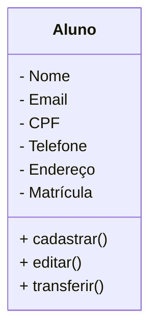

# Projeto Universidade

Modelagem em orientação à Objetos das Entidades Alunos, Cursos e Turmas

##  Caso de Uso
```mermaid
flowchart LR 
    Usuario([secretaria])

    UC1((Cadastrar Alunos))
    UC2 ((Editar Alunos))
    UC3 ((Transferir Aluno))

    Usuario --> UC1
    Usuario --> UC2
    Usuario --> UC3
```

## Diagrama de Classes 


## Dependências
- **VSCode**: IDE(Interface de Desenvolvimento)

- **Mermaid**: Linguagem para 
confecção de Diagramas em 
documentos MD (Mark Down) 

- **Material Icon Theme**: Tema para colorir
 as pastas.

 - **Git Lens**: Interface gráfica para o versionamento .git integrada 
 ao VSCode. 